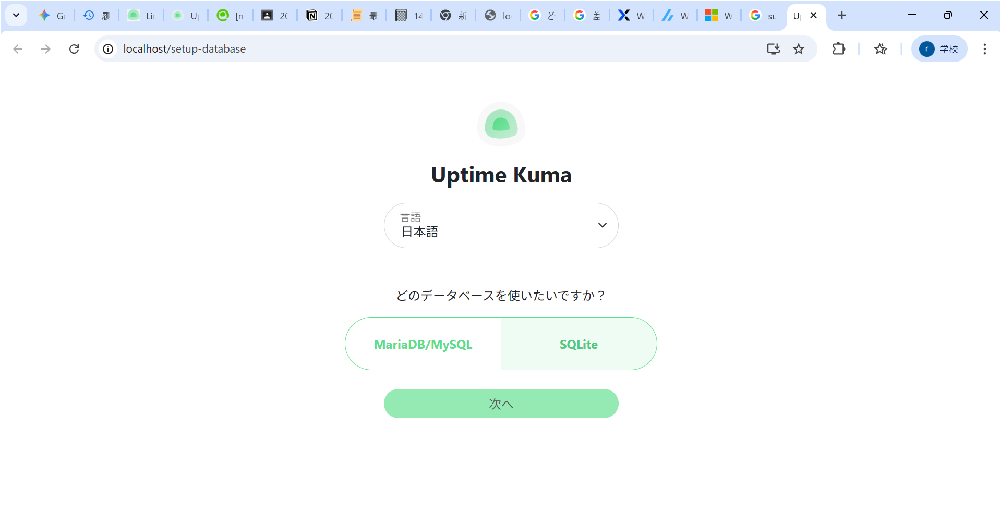
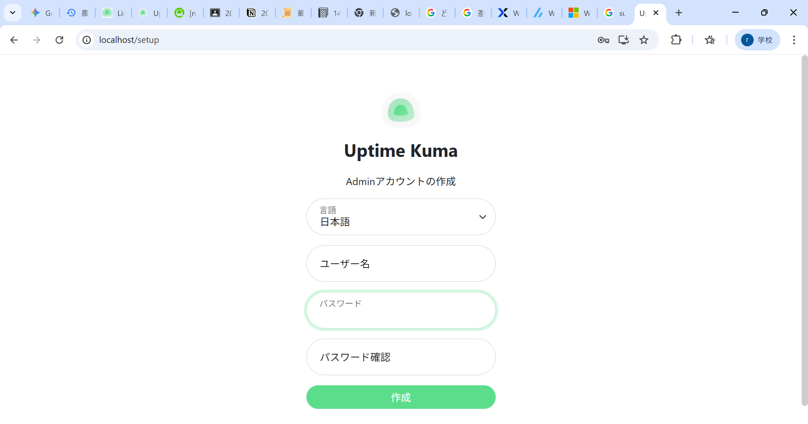
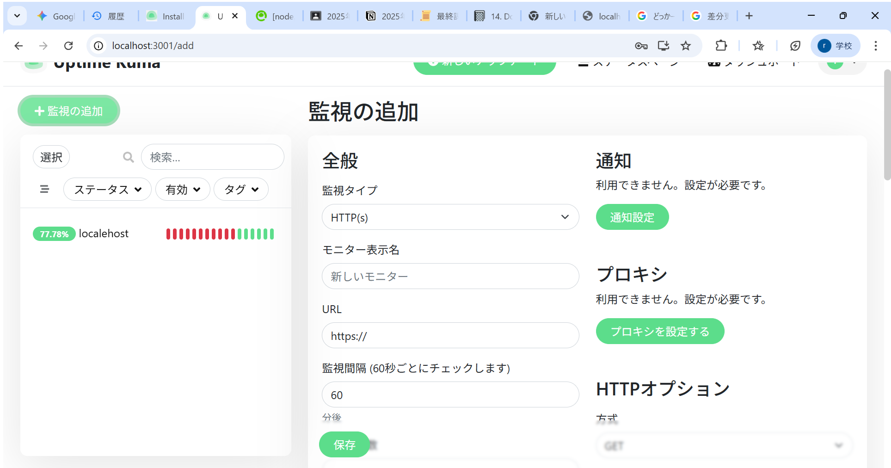

# Dockerで立ち上げたWebサーバーをUptime-Kumaで監視するための手順書

**作成者:** 3年 Iコース 36番

## 1. 目標
Dockerで立ち上げたWebサーバーのURLを、Uptime-Kumaに入力し、正常と判定させること。

## 2. システム構成
* **OS:** Ubuntu 24.04.5 LTS
* **カーネル:** 6.6.87.2-microsoft-standard-WSL2
* **実行環境:** ローカル環境 (WSL 2.6.1.0)
* **ネットワーク条件:** NAT構成
* **利用ツール:** apt, npm/n, Docker Engine, git, pm2, systemd

---

## 3. 手順詳細

### 3-1. 事前準備 (システム更新とファイアウォール)
WSLでLinuxをインストールしていない場合は，以下のように入力しアカウントとパスワードを設定する．
```bash
wsl
wsl.exe --install Ubuntu-22.04
```

Ubuntuのパッケージリストを更新し、インストールされているパッケージを最新にする。

```bash
# パッケージリストの更新とアップグレード
sudo apt update
sudo apt upgrade -y
```

次に、セキュリティのためにファイアウォール（UFW）の設定を行う。

```bash
# 1. デフォルトの通信をすべて「拒否」に設定
sudo ufw default deny incoming

# 2. SSH接続（リモート操作）を許可(一応)
sudo ufw allow ssh

# 3. Webアクセス（HTTP/HTTPS）を許可
sudo ufw allow http
sudo ufw allow https

# 4. ファイアウォールを有効化
sudo ufw enable

# 5. 設定状況の確認
sudo ufw status verbose
```

### 3-2. Node.js と npm の環境構築 (nを使用した方法)

Uptime-Kumaの動作に必要なNode.js環境を整える。`n` パッケージを使用して安定版（stable）を導入し、古いapt版を削除して整理する。

```bash
# apt経由でnodejsとnpmを一旦インストール
sudo apt install -y nodejs npm

# Node.jsのバージョン管理ツール「n」をグローバルインストール
sudo npm install n -g

# 「n」を使って安定版のNode.jsに更新
sudo n stable

# 古いapt版のnodejsとnpmを削除（競合回避のため）
sudo apt purge -y nodejs npm
sudo apt autoremove -y
```

### 3-3. Dockerのインストール

Webサーバーを立ち上げるためのDocker環境の構築を行う。

```bash
# 1. 競合する古いパッケージの削除
for pkg in docker.io docker-doc docker-compose docker-compose-v2 podman-docker containerd runc; do sudo apt-get remove $pkg; done

# 2. 公式GPGキーの追加
sudo apt-get update
sudo apt-get install ca-certificates curl
sudo install -m 0755 -d /etc/apt/keyrings
sudo curl -fsSL https://download.docker.com/linux/ubuntu/gpg -o /etc/apt/keyrings/docker.asc
sudo chmod a+r /etc/apt/keyrings/docker.asc

# 3. リポジトリの追加
echo \
  "deb [arch=$(dpkg --print-architecture) signed-by=/etc/apt/keyrings/docker.asc] https://download.docker.com/linux/ubuntu \
  $(. /etc/os-release && echo "$VERSION_CODENAME") stable" | \
  sudo tee /etc/apt/sources.list.d/docker.list > /dev/null

#aptの更新
sudo apt-get update

# 4. インストール(途中Y入力必要)
sudo apt-get install docker-ce docker-ce-cli containerd.io 
docker-buildx-plugin docker-compose-plugin 

# 5. 現在のユーザを docker グループに追加

sudo usermod -aG docker $USER

# 6. 設定を反映（一度ログアウトするか、以下のコマンドを実行）
newgrp docker
```

### 3-4. DockerでWebサーバーの立ち上げ

構築したDockerを用いてWebサーバーを立ち上げる

```bash
# フォルダ作成
mkdir -p ~/docker-webserver/htdocs
# ディレクトリ移動
cd ~/docker-webserver

# テスト用HTMLファイルの作成
echo '<h1>Hello, Docker World!</h1>' > htdocs/index.html
# ホストの8080番ポートを、コンテナの80番（Web）につなぐ
# ホストの htdocs フォルダを、コンテナの公開フォルダにマウントする
docker container run -dit -p 8080:80 \
  --name my-apache-app \
  -v ~/docker-webserver/htdocs:/usr/local/apache2/htdocs/ \
  httpd:2.4
# 一つ上の階層のフォルダへ行く
cd ..
```
### 3-5. Uptime-Kuma のインストールと起動

監視ツールであるUptime-Kumaのセットアップを行う。

```bash
# 前提パッケージの確認（念のため更新とgitインストール）
sudo apt update
sudo apt update && sudo apt install -y git
# GitHubからUptime-Kumaのソースコードをクローン（ダウンロード）
git clone https://github.com/louislam/uptime-kuma.git

# ディレクトリの移動
cd uptime-kuma

# セットアップスクリプトの実行（依存関係のインストール等）
npm run setup

# プロセス管理ツール PM2 のインストール
sudo npm install pm2 -g 

# PM2を使ってUptime-Kumaをバックグラウンドで起動
pm2 start server/server.js --name uptime-kuma

# システム起動時にPM2が自動起動するように設定
pm2 startup
```

### 3-6. Nginx (リバースプロキシ) の設定

一度カレントディレクトリに移動した後Uptime-Kuma（ポート3001）に、標準的なWebポート（80番）でアクセスできるようにNginxを設定します。

```bash
# Nginxのインストール
sudo apt install nginx -y

```

設定ファイルを作成・編集します。以下のコマンドを実行するとエディタが開く。  


```bash
# 設定ファイルの作成と編集
sudo vim /etc/nginx/conf.d/uptime-kuma.conf
```

**【vimエディタ内での操作】**
1.  `i` キーを押して入力モードにする。
2.  以下の内容をコピーして貼り付ける。
3.  `Esc` キーを押し、`:wq` と入力してEnter（保存して終了）。

```nginx
server {
  #80番ポートを使う
    listen 80;
  #どんなIPでもこれを使うようにする
    server_name _;

    location / {
        proxy_pass         http://localhost:3001;
        proxy_http_version 1.1;
        proxy_set_header   Upgrade $http_upgrade;
        proxy_set_header   Connection "upgrade";
        proxy_set_header   Host $host;
        proxy_set_header   X-Real-IP $remote_addr;
        proxy_set_header   X-Forwarded-For $proxy_add_x_forwarded_for;
        proxy_set_header   X-Forwarded-Proto $scheme;

        # Added WebSocket support
        proxy_set_header   Sec-WebSocket-Key $http_sec_websocket_key;
        proxy_set_header   Sec-WebSocket-Version $http_sec_websocket_version;
        proxy_set_header   Sec-WebSocket-Extensions $http_sec_websocket_extensions;

        # Improve performance of this reverse proxy
        proxy_buffering    off;
    }

    # Redirect HTTP to HTTPS if needed for encryption
    # Uncomment the following lines if you have SSL enabled
    # return 301 https://$host$request_uri;
}
```
設定ファイルの保存パスは/etc/nginx/conf.d/  
所有権 root  
権限はrw-r-r
となる．  


最後に、デフォルト設定を無効化してNginxを再起動します。

```bash
# デフォルトのサイト設定を削除（競合回避）
sudo rm /etc/nginx/sites-enabled/default

# 設定変更を反映するためにNginxを再起動
sudo systemctl restart nginx
```

---

 ### 動作確認
windowsのブラウザを開き、`http://localhost` と入力して 図1に示すようなUptime-Kumaの画面が表示されるか確認する。

<div style="text-align: center;">
図1. 最初の画面
</div> 

確認出来たらSQLiteの方を選択して
「次へ」をクリックする
そうしたら図2に示すような画面が出てくるのでアカウントとパスワードを設定して「作成」をクリックする．

<div style="text-align: center;">
図2. アカウント作成画面
</div> 
そうしたら図3に示すような画面が出てくるので左上の「+監視の追加」をクリックして，出てくる図4の画面でURLに

`http://localhost:8080`

と入力した後に「ダッシュボード」に戻り，「正常1」と出ていれば終了


<div style="text-align: center;">
図3. メイン画面
</div> 


<div style="text-align: center;">
図4. 監視対象の設定画面
</div> 


 ### トラブルシューティング
  - 図4の画面でURLを入力したら異常と出る  
    まず，

    `http://localhost:8080`

    をブラウザに入力してみる  
    画面にHello,DockerWorld!と出たら
    おそらく図4の段階でURLの入力を間違えていると考えられる  
    出ない場合

    `docker ps -a`

    と入力して
    httpd:2.4のSTARUSがExitedとなっていたら
    CONTAINER IDを確認して
  
    `docker start CONTAINER_ID`

    何もなかったら3-4の作業をやったか確認してください
  - http://localhostに移動しても図1の画面が出ない
  
    502 Bad Gatewayとでる 場合 
    Uptime-Kuma が停止していると考えられるので  
    3-5を行ったか確認して行ったなら
    Ubuntu上で
    ```bash
    cd uptime-kuma

    pm2 resutart uptime-kuma
    ```
    と入力
    そもそもアクセスできない場合
    nginxが止まっている可能性があるので
    3-6を行ったか確認して行ったなら  
    `sudo systemctl start nginx`

 ### 参考資料
 - WSL のインストール | Microsoft Learn,https://learn.microsoft.com/ja-jp/windows/wsl/install
 - Install Uptime Kuma on Linux,https://uptimekuma.org/install-uptime-kuma-linux/
 - Server names,https://nginx.org/en/docs/http/server_names.html